# 💳 E-Wallet

A secure and modern digital wallet application inspired by InstaPay, built with Flutter and Firebase.

## 📌 Overview

E-Wallet is a fintech mobile application that allows users to securely transfer and deposit money using a simple and intuitive interface.

The application focuses on transaction reliability and consistency by using Firestore atomic transactions and idempotency protection to prevent duplicate operations.

## 🎥 Demo Video

https://github.com/user-attachments/assets/65360560-5fb7-4f36-a5da-e66594e3ddd7

## ✨ Features

- 📱 Phone Authentication with OTP verification
- 🔐 PIN/Fingerprint verification for sensitive actions
- 💸 Money transfer using phone number
- 💳 Deposit money using Paymob integration
- 📜 Transaction history with ledger system
- 🌙 Dark mode support
- 🌍 Arabic & English localization
- 🔄 Hydrated state persistence
- ⚡ Atomic transactions using Firestore transactions
- 🛡️ Idempotency protection against duplicate requests

## 📸 Screenshots

### 🔐 Authentication

| Login | OTP Verification | Biometric / PIN |
|-------|-----------------|-----------------|
|  | 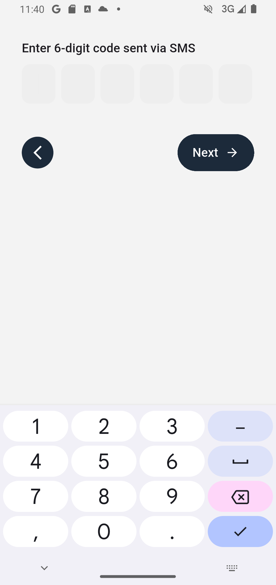 | 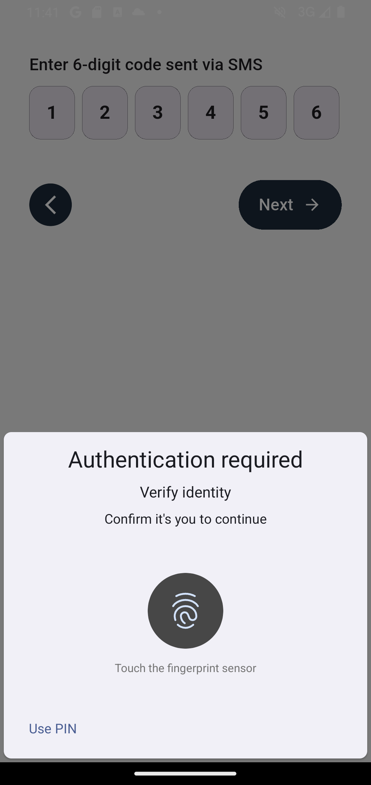 |

---

### 🏠 Dashboard & Navigation

| Home (Light) | Home (Dark) | Arabic Localization |
|-------------|-------------|---------------------|
| 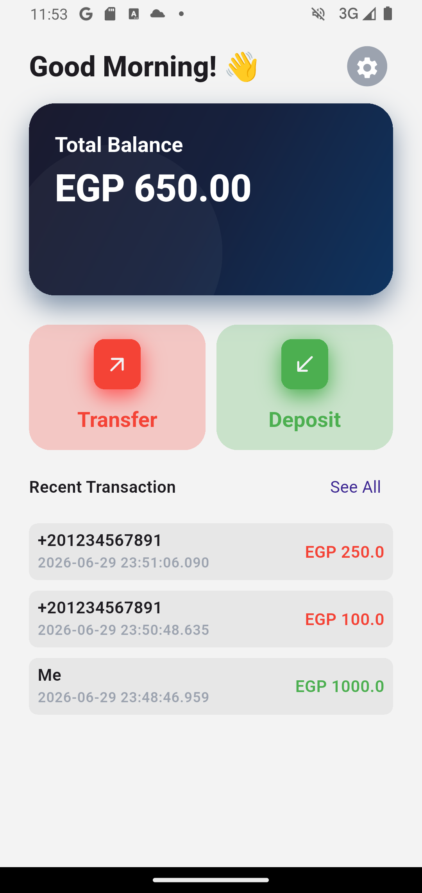 | 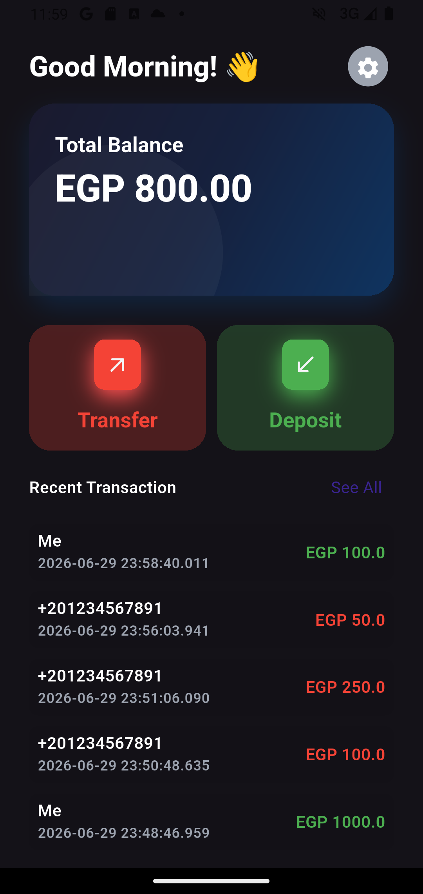 | 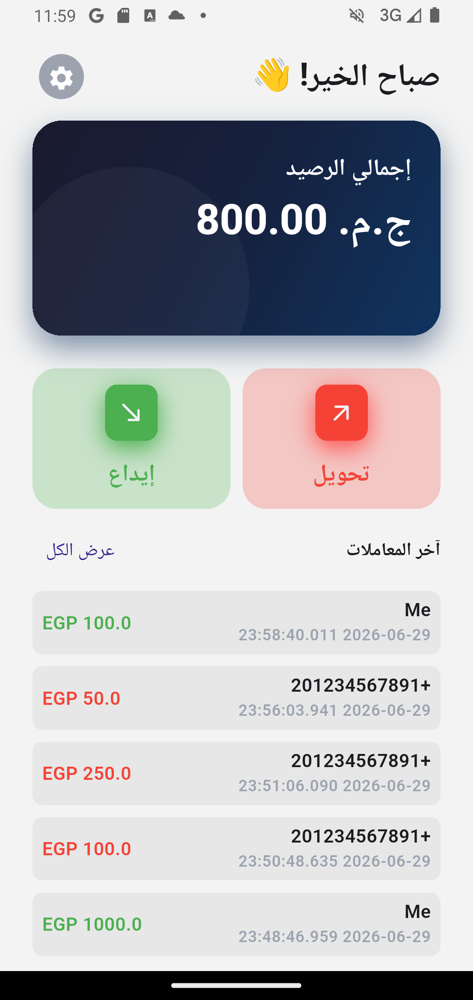 |

| Drawer |
|--------|
| 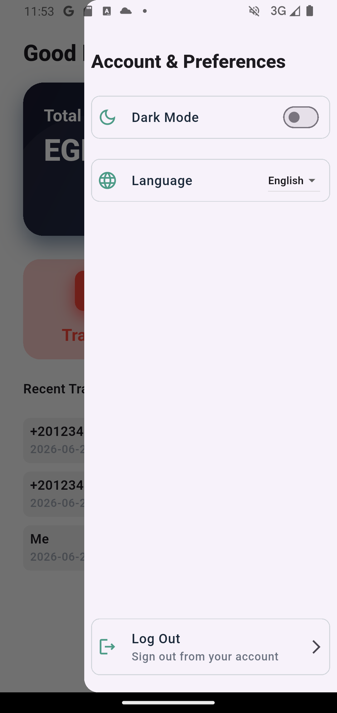 |

---

### 💸 Money Transfer

| Transfer Sheet | Transfer Verification | Success |
|---------------|----------------------|---------|
| 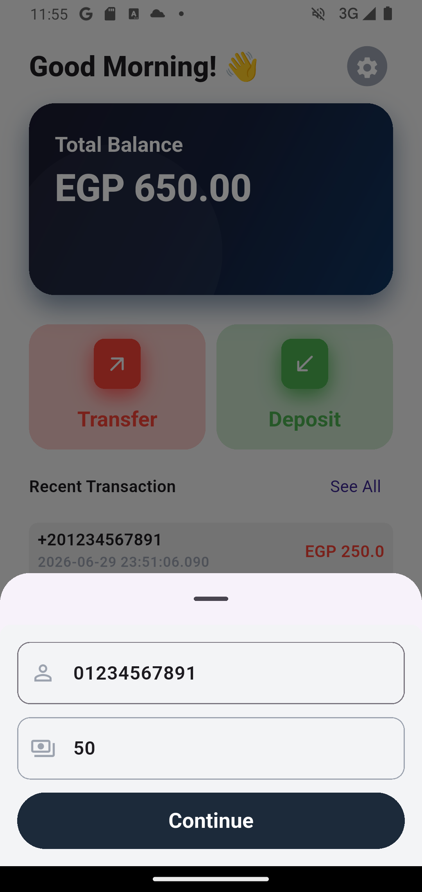 | 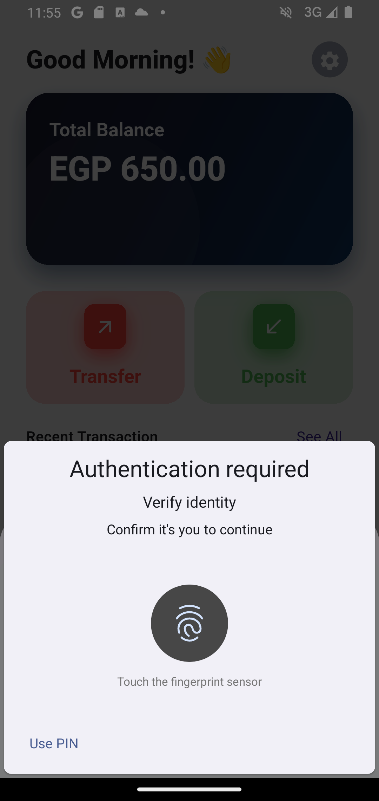 | 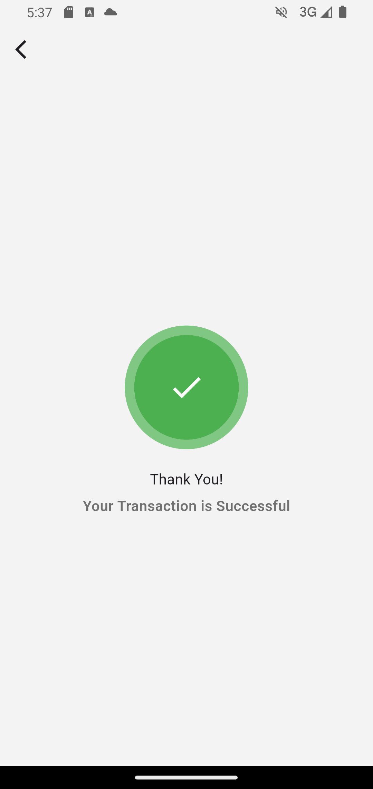 |

---

### 📜 Transaction History

| Transaction History |
|--------------------|
| 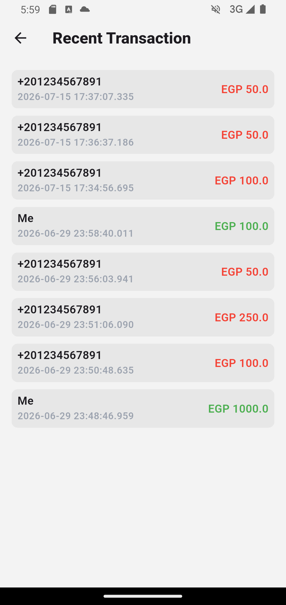 |

---

### 💳 Deposit Flow

| Deposit Sheet | Paymob Integration |
|--------------|-------------------|
| 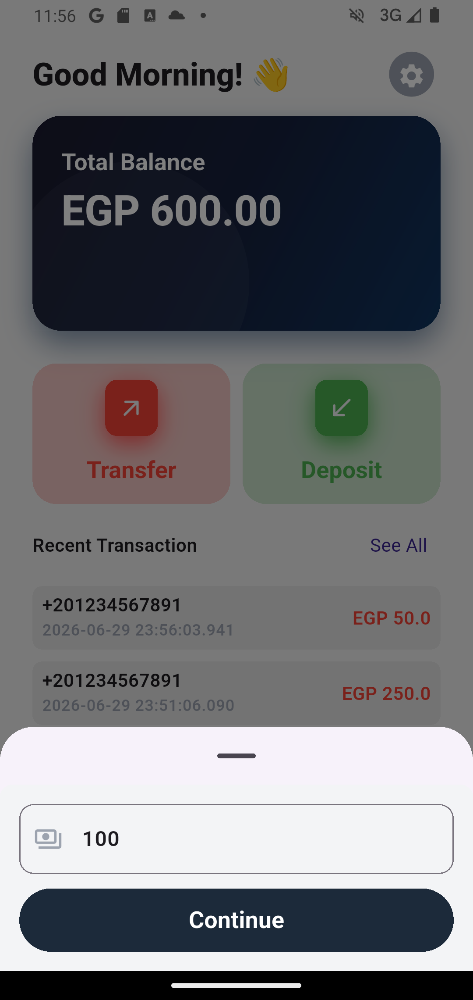 | 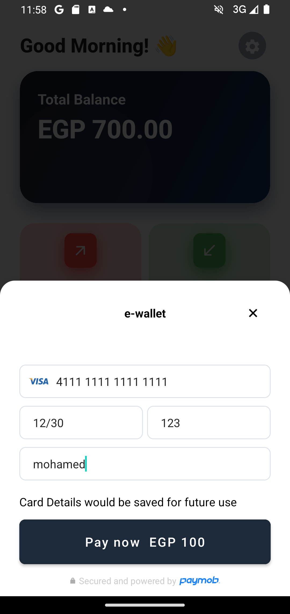 |

## 🔒 Transaction Safety

To ensure transaction consistency and prevent duplicate operations:

- Firestore atomic transactions are used to guarantee consistency between sender and receiver balances.
- Idempotency keys prevent duplicate transaction processing caused by retries or repeated requests.
- Ledger entries provide a complete and auditable transaction history.

## 🏗️ Architecture

- MVVM Architecture
- Repository Pattern
- Dependency Injection using GetIt
- State Management using Flutter Bloc/Cubit
- Feature-Based Project Structure

## 🛠️ Tech Stack

- Flutter
- Dart
- Firebase Authentication
- Cloud Firestore
- Flutter Bloc
- GetIt
- Hydrated Bloc
- Paymob SDK
- Flutter Intl
